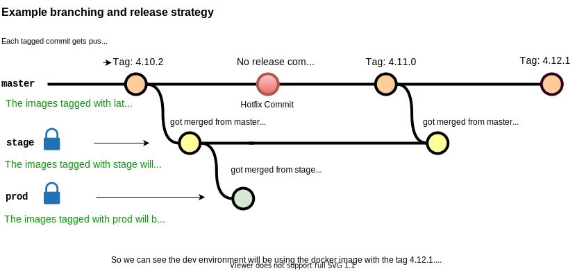

# azure.ghost-web-app-for-containers

A one-click [Ghost](https://ghost.org/)  deployment on [Azure web app for Containers](https://azure.microsoft.com/en-us/services/app-service/containers/). The architecture is described in much greated detail below.

## Deploy

[](https://portal.azure.com/#create/Microsoft.Template/uri/https%3A%2F%2Fraw.githubusercontent.com%2FGitarPlayer%2Fghost-azure-bicep%2Fmaster%2Fghost.json)

## Acceptance Criterias
The Acceptance Criterias will be abbreviated with AC1 to AC6.
1. The application should be able to scale depending on the load. 
2. There should be no obvious security flaws.
3. The application must return consistent results across sessions.
4. The implementation should be built in a resilient manner.
5. Observability must be taken into account when implementing the solution.
6. The deployment of the application and environment should be automated.

## Functional Requirements
The Functional requirements will be abbreviated with FR1 to FR2.
1. The ghost blogging platform should be used
2. There is a serverless function that deletes all the posts

## Non Functional Requirements
The Non Functional Requirements will be abbreviated with NFR1 to NFR7.
1. the solution should be able to adapt to traffic spikes. It is expected that during the new product launch or marketing campaigns there could be increases of up to 4 times the typical load.
2. that the platform remains online even in case of a significant geographical failure.
3. interested in disaster recovery capabilities in case of a region failure.
4. The teams want to be able to release new versions of the application multiple times per day, without requiring any downtime.
5. The customer wants to have multiple separated environments
6. need tools to support theiroperations and help them with visualising and debugging the state of the environment
7. the security team also needs to have visibility into the platform and its operations

## Architecture
This HLD describes the architecture of one environment. There will be three environments: dev, stage and prod.

The orange arrows show the logs of the various services that are being sent to the Log Analytics Workspace.
The green arrows show CI/CD flows.
The black arrows show application flows.


The application runs on Azure App Service and is deployed from a public Container image stored on DockerHub. State is stored in a MySQL Flexible server and in a Azure File Share that is mounted into the container. The FR2 is implemented with an Azure App Function that runs in the same App Service Plan (to reduce complexity and to save costs). The Azure App Function and the Ghost Azure web app are configured for AppInsights for Observability reasons . The Azure App Function requires Blob storage to store the keys to trigger the function (authentication & authorization). Azure Key Vault for now stores only the MySQL root password and the Ghost Azure web app fetches the password from the Vault. Ideally as a day two operation the ghost admin api key should also be stored there and the App function should be configured to reach Azure Key Vault (not part of this PoC). Every resource sends data to the Log Analytic Workspace for monitoring and logging purposes . The web application is only reachable via the Azure FrontDoor URL as an additional layer of protection. This offers DDos / Bot protection and also other common threats (SQL injections for example). Microsoft Sentinel is configured as a SOC for the security engineers of the company.

## AC, FR, NFR fit
| Requirement  | How it is implemented / covered  |
|---|---|
| AC1  | The App Service is configured to scale depending on CPU load, Azure Front Door enables server side caching, MySQL Server can be scaled up (manually or with Azure Automation not part of the PoC)  |
| AC2  | All communications are encrypted, secrets stored in Azure Key Vault and a WAF is in use. MySQL server only allows access from sources within Azure |
| AC3  | MySQL guarantees consistency as a relational database so does Azure File Share through File locks. |
| AC4  | The App Service is deployed in a zone redundant way, so is the MySQL server and the storageAccount. All components can handle the failure of one  availability zones with no manual intervention. In a region failure disaster recovery is possible. |
| AC5  | Azure App Insights is configured for the web app and for the Azure Function. |
| AC6  | The environment can be deployed with bicep and the deployment of the application is done with GitHub actions and continious deployment for the web app. |
| FR1  | The image used for the web app builds on top of the official ghost docker image (extends it for App Insight support)  |
| FR2  | An Azure function in JavaScript has been implemented that deletes all the posts. It is explained in greater detail below. |
| NF1  | The Auto Scale Setting of the web app should be able to handle the traffik spikes. Sensible caching with Azure Front Door should reduce the load on the Backend greatly. An actual load test would have to be done (maybe with Scrapy?) |
| NF2  | The platform can handle the loss of one availabilty zone with no manual intervention needed. |
| NF3  | Depending on RTO/RPO and budget different disaster recovery scenarios may be applicable. This PoC implemented the least complex scenario and the cheapest (without saying the one with the biggest RTO/RPO). |
| NF4  | The Azure app service code will be deployed from container images from DockerHub. There are three tags latest, stage and prod. Each environment will deploy the new image as soon as a new container image with their relevant tag is available. The use of deployment slots in prod will make sure that there is no downtime. |
| NF5  | There are three environments for the PoC: dev, stage and prod. Dev is less available and less performant than stage and prod for cost saving reasons. Stage and Prod are absolutely identical in every aspect so developers have a proper staging environment. The git repository is setup in a way that the master branch commits with a release tag will be deployed to dev (with the latest tag). Merged pull requests from master to stage will be deployed to the stage environment. Merged pull request from stage will be deployed to the warm up prod slot (the swap from warm up to prod has to be done manually, since it is not yet supported for Linux host OS machines.) |
| NF6  | Azure App Service comes with a vast array of tools to troubleshoot your web application (Log Stream, SSH access to the host, SFTP access). Furthermore AppInsight is enabled and all diagnostic data and logs are sent to Azure Log Analytics. |
| NF7  | Through the use the WAF of Azure Front Door the security engineer gain insight into the traffic of the web application. The Azure Log Analytics is configured with Microsoft Sentinel. Since all the logs are in Azure Log Analytics it is ideal for SOC operation. |

### Improvements
1. The code could be extended for MySQL read replicas because that would enable Active/Passive disaster recovery. Unfortunately scaling out horizontally is not possible without further engineering (because the ghost application natively does not support sending read request to a read-only MySQL instance), so something like ProxySQL or some routing rules with Azure Front Door are needed.. Furthermore with read replicas the application could handle the loss of up to two zone-level failures.
2. The MySQL database should be reached with a private endpoint and a Vnet for optimal security (increases complexity quite a bit though).
3. A private Azure Container registry would probably be used instead of DockerHub. 

## CI/CD and source code
The GitHub repo for building the image and pushing it to DockerHub can be found here:
https://github.com/GitarPlayer/docker-ghost-ai

The GitHub repo for the Azure Function that deletes all posts can be found here:
https://github.com/GitarPlayer/azure-function-ghost

The branching strategy for the web app docker image is as described in the diagram below. *Every tagged commit on master will be pushed to DockerHub with the semantic tag and the latest tag.*  



The GitHub Action for the Azure Function uses a different workflow. Every semantic versioning tagged commit ([0-9].[0-9].[0-9] is the pattern) triggers the workflow. The workflow does the following:
1. build the the node.js app
2. zip it so it can be deployed as an Azure Function
3. create a GitHub release with the deployable Azure Function zip.

The Azure Function then gets the relevant version like so
```bicep
    siteConfig: {
      appSettings: [
        {
          name: 'WEBSITE_RUN_FROM_PACKAGE'
          value: pkgURL 
      ]
// pkgURL is 
// https://github.com/GitarPlayer/azure-function-ghost/releases/download/0.0.9/app.zip for example
```
I choose public repositories and a public Docker repo because I did not want the reviewer of this challenge to deal with publish profiles nor did I want to automate the build to a private PoC Azure Container registry. 
### Improvements
1. Retag docker images when merging from master to stage and stage to prod. Currently they get built once when they get the semantic versioning tag and when they get merged. They should be simply retagged in the latter case because if the prod branch is on 4.10.2 for example then the :prod image and the :4.10.2 image show different SHA256 digests even though the source code is identical.
2. The deployment of the azure function can also be done with a container. This would simplify the architecture because there would be only one release GitHub action to maintain and understand.
## The environments 
Prod and stage do not differ and look exactly like the HLD described above but dev does differ from the others. There are two differences:
1. Dev is directly exposed directly with Azure App Service and not behind Azure Front Door. The illustration below shows this more clearly.


1. Dev is a more lightweight version with less availability and throughput. 
### Improvements
1. One could create a module that creates an environment with better logic if this were to be used in production. Refactoring the code base would much improve the readibility and stability of the code.
2. Dev could probably get away with using App Service Storage and no dedicated Azure File Share. Also the tier can be optimized for probably almost all resources. The azure function could run in consumption plan if the free tier does not support hosting an Azure function.


## Diaster recovery 
Since I opted for Zone-redundant HA MySQL flexible server for the relational database, read replicas are not supported as of yet but it is on the roadmap. 


| Component | Failover Procedure | RTO  | RPO |
|---|---|---|---|
| Azure App Service | Restore app to a different region  | RTO depends on snapshot frequency, default < 1h | RPO < 1 h |
| Azure Function | Restore function to a different region  | RTO depends on snapshot frequency, default < 1h | RPO < 1 h |
| Azure Database for MySQL | Geo-restore from geo-replicated backups | RTO depends on backup frequency, default < 1d | RPO < 1h  |
| Azure Key Vault  | automatic by Azure  | 0 | 0 |
| Azure Front Door | service that spans regions, we need to point to the restored App Service in the paired region manually | 0 | 0 |
| Storage Account (File Share, Blob)  | account failover to paired region  | typically < 1h  | typically < 15min  |
| Log Analytics Workspace/Sentinel | needs to be recreated, currenlty there are no recovery options | ? | 0 |

From the table above we can see that for the application itself has an RTO of less than 1 day and a RPO of less than 1 hour.

## Availabilty
The table below lists the availability of each service and the composite availability:

| Service  | Availability |
|---|---|
| App Service  | 99.95% |
| Azure Function  | 99.95% |
| Azure Database for MySQL | 99.99% |
| Azure Key Vault  | 99.99% |
| Azure Front Door/WAF | 99.99% |
| Storage Account  | 99.99999999999999% |
| Log Analytics Workspace/Microsoft Sentinel/Application Insights | 99.9% |
| Azure DNS | 100% |
| Azure DNS | 100% |
| Composite SLA | 0.9977018793% |

The composite SLA in days, weeks, etc:  
Daily: 3m 18s  
Weekly: 23m 9s  
Monthly: 1h 40m 43s  
Quarterly: 5h 2m 10s  
Yearly: 20h 8m 41s

## Alternative Architectures for lower RTO and RPO
If an RPO of 1h and a RTO of 1 day is not acceptible there are two other alternative architectures that could be implemented. As outlined by Microsoft themself: https://docs.microsoft.com/en-us/azure/architecture/reference-architectures/app-service-web-app/multi-region


They outline  three different scenarios:
1. Active/Passive with hot standby
2. Active/Passive with cold standby
3. Active/Active

Scenario 3 is hard to implement because the only way to do a multi region deployment is by Geo-replication of the SQL Database with read replicas. So only one region can be fully active since the other will be just a read only replica. The ghost web application would have to be rewritten to do read request to the read only endpoint and writes to the read write endpoint. This is out of scope for this PoC.

But for App Service Plan you pay for the VMs whether apps are running on it or not. Furthermore the MySQL read replica must be running too to be in sync. So in the end it makes more sense to use a hot standby since you will pay the same amount for a cold one. In our architecture this would mean simply deploying the App Service Plan, App Service, Log Analytics Workspace and the Azure Function in two regions. Plus additionally confiugre a read replica MySQL server in the paired region. The storage account must be setup to GRS/RA-GRS (RA-GRS offers the benefit that in a region failure the application can read immediately without the failover). Additionally the front door configuration must add a second pool and a failover must be configured. Then in case of a region failure the read replica gets promoted to be the read/write instance (either manually or with auto-failover), the storage account failover is triggered (manually) and FrontDoor routes traffic to the paired region App Service (since the failed region will not pass the HTTP healthchecks anymore).

The RTO and RPO of this solution would be:  
RTO: < 1h  
RPO: < 15min

The bottleneck in this architecture is the storage account failover as the MySQL RTO is - Minutes* and its RPO < 5 Minutes. In practice when RA-GRS is used one could wait with the failover for outside business hours, because users browsing the content rarely if never writes to the Azure File Share, only if an admin uploads images or edits themes write acess is needed. Thus, the storage account failover could be initiated outside of peak time, then the RPO is even less (less than 5min, the time to promote a read replica MySQL to master). Furthermore this architecture would allow the failure of up to two availability zones since then we could have 2 read replicas of the MySql server in the active region.

This solution comes not only with more costs but also the complexity increases quite a bit too (failover groups, configuring auto-failover because MySQL Flexible Server HA mode fails without additional configuration). The configuration of the resources deployed in both regions need to be kept in sync manually with IaC ideally (except for the MySQL database.)

To optimize security the databases could be exposed with private endpoints and Virtual Network Peering between the active and passive region could be established. This is also outlined here: 

https://docs.microsoft.com/en-us/azure/architecture/example-scenario/sql-failover/app-service-private-sql-multi-region

This image visualizes it quite well:


## Why not AKS or Azure Container Apps
### Why not AKS
I did not choose AKS because for an application that consist of one container it is overkill to have a container orchestration solution (even if it's a managed one). Because at the end of the day you are still responsible for Kubernetes version upgrades (even though it is much easier than with vanilla kubernetes) and the upgrade to all the components you need (Flux, Nginx Ingress Controller). And more importantly Kubernetes is one of the fastest growing Open Source Project so you always have to make sure that your YAML manifest are still compatible with new API releases. It just adds too much complexity for what it's worth. If it is really important to be able to gain experience with k8s or to deploy it to any cloud then of course it would be considerable. There is this helm chart which would greatly accelerate the time to market: https://github.com/bitnami/charts/tree/master/bitnami/ghost

### Why not Azure Container Apps
This is a very good alternative for Azure App Service because the HTTP based horizontal scaling is very attractive. Also with App Service you seem to overprovision more (because you don't want your app service VMs overloaded but if they use too little CPU you waste resources). What made me opt for Azure App Service is that it is optimized for web apps and that it integrates really well with Azure Function (they can share the App Service Plan Tier). Plus it seems like a more mature solution (the documentation is way more elaborate on the App Service side) and it offers more flexibility in regard of the deployment of the solution (zip, source code, container). Also the scaling is probably not that relevant because the content you serve with Ghost is fairly static and with sensible caching with Azure Front Door you scale more efficient anyways.

## Day 2 operations


### Known issues
If you are unlucky and somehow the App Service restarts your container during the initial database setup it is configured with a lock and the container keeps retarting because it can never initialize the database because of the existing lock. The logs show something like this:
```bash
Unhandled rejection MigrationsAreLockedError: Migration lock was never released or currently a migration is running.
```

You need to manually remove the lock by login into the SQL server and running a command:
```bash
# just use Azure Cloud Shell for simplicity
sudo apt-get install mysql-client
wget --no-check-certificate https://dl.cacerts.digicert.com/DigiCertGlobalRootCA.crt.pem
mysql -h prod-ghost-mysql-exghjb3mkk3wc.mysql.database.azure.com -u ghost --ssl-crl=DigiCertGlobalRootCA.crt.pem -p
use ghost;
UPDATE migrations_lock set locked=0 where lock_key='km01';
quit;
```

### Add the GHOST ADMIN API KEY to the delete all posts function
1. Go to your frontdoor resource and open the URL that points to your ghost backend. You cannot go directly to the app service URL because in prod and stage you will get 403 because of WAF.

Here it's https://prod-ghost-fd-kb4d25tc47hig.azurefd.net
2. Go to $FRONT_DOOR_URL/ghost/ 
Here it's https://prod-ghost-fd-kb4d25tc47hig.azurefd.net/ghost/
4. Create an admin account


5. Skip Adding Users

6. Create a custom integration


7. Copy the API KEY
8. 
9. Configure it for the apps setting of the App Service of that site

10. Test it from Azure Function 

11. You should no longer see the default posts in your $FRONT_DOOR_URl. Here
Here it's https://prod-ghost-fd-kb4d25tc47hig.azurefd.net


